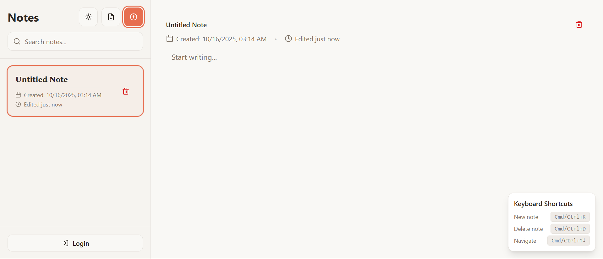

# 🎯 Scratchpad Scribe

[](#-about)
[](https://vitejs.dev/)
[](https://www.typescriptlang.org/)
[](https://tailwindcss.com/)
[](LICENSE)
[](https://hacktoberfest.com/)
[](#-contributing)
> Scratchpad Scribe is a fast, minimal, and themeable note-taking workspace built with React, TypeScript, Vite, Tailwind CSS, and shadcn/ui components.



## Table of Contents
- [🗒️ About](#-about)
- [🎯 Use Cases](#-use-cases)
- [✨ Features](#-features)
- [🧩 Tech Stack](#-tech-stack)
- [🧱 Architecture](#-architecture)
- [🚀 Getting Started](#-getting-started)
- [🔐 Environment Variables](#-environment-variables)
- [🛠️ Available Scripts](#-available-scripts)
- [🤝 Contributing](#-contributing)
- [🧑‍🤝‍🧑 Community & Support](#-community--support)
- [📄 License](#-license)

## 🗒️ About

Scratchpad Scribe gives you a distraction-free editor for quickly capturing ideas, meeting notes, or research summaries. Notes are stored locally for instant performance, while an optional Node/Express backend provides authentication scaffolding when you are ready to sync across devices.

- Sleek, dark-mode-friendly interface powered by Tailwind CSS and shadcn/ui.
- Local-first UX with instant persistence and optimistic updates.

## 🎯 Use Cases
### Frontend (client)
```bash
# 1. Clone and enter the repository

git clone https://github.com/DhanushNehru/scratchpad-scribe.git
cd scratchpad-scribe

# 2. Install dependencies (npm)

npm install

# 3. Start the Vite dev server

npm run dev

# 4. Visit the app in your browser

http://localhost:5173
```

### Backend (optional, for auth & API)
```bash
# Run from the project root
cd backend

# Install server dependencies
npm install

# Start the API server in development mode (defaults to port 5000)
npm run dev
```

Create a `.env` file inside `backend/` with the variables described below before starting the server.

With both servers running, set `VITE_API_BASE_URL` so the frontend can communicate with the backend.

## 🔐 Environment Variables

Create a `.env` file in the `backend/` directory and an optional `.env` (or `.env.local`) in the project root for frontend variables.

| Variable | Location | Required | Description | Example |
|----------|----------|----------|-------------|---------|
| `VITE_API_BASE_URL` | Frontend | Optional | Base URL for the Express API when enabling auth | `http://localhost:5000/api` |
| `MONGO_URI` | Backend | Yes | MongoDB connection string | `mongodb+srv://...` |
| `JWT_SECRET` | Backend | Yes | Secret used to sign auth tokens | `super-secret-value` |
| `PORT` | Backend | No | Port the Express server listens on | `5000` |

## 🛠️ Available Scripts

| Command | Directory | Description |
|---------|-----------|-------------|
| `npm run dev` | project root | Start the Vite development server |
| `npm run build` | project root | Generate a production build |
| `npm run preview` | project root | Preview the production build locally |
| `npm start` | `backend/` | Run the Express API in production mode |

## 🤝 Contributing

We welcome contributions of all sizes—bug fixes, documentation improvements, or full features. To keep reviews smooth:

1. **Fork** the repository and create a feature branch (`git checkout -b feature/amazing-improvement`).
2. **Install dependencies** and reproduce the issue or feature locally.
3. **Write your fix/feature** with tests or screenshots where helpful.
4. **Commit** with clear messages and push your branch.
5. **Open a Pull Request** describing the change, impact, and testing notes.

Additional tips:
- Keep PRs focused—one change per pull request makes reviews faster.
- Update documentation when behavior or commands change.
- Be respectful and collaborative in discussions; we follow the [Contributor Covenant](https://www.contributor-covenant.org/) spirit.


## 🧱 Architecture

The repository ships with a Vite-powered frontend and an optional Express backend. Each piece can run independently, making it easy to plug in your own API or iterate on the UI in isolation.

```bash
scratchpad-scribe
├── src/                 # React application source
│   ├── components/      # UI building blocks and editor widgets
│   ├── context/         # Current user context providers
│   ├── hooks/           # Reusable hooks (notes, auth, responsive helpers)
│   ├── pages/           # Top-level routes (Index, NotFound)
│   └── utils/           # Auth helpers, UUID utilities, formatting logic
├── backend/             # Express server for auth and persistence
│   ├── controllers/     # Route handlers (registration, login, profile)
│   ├── middleware/      # Auth verification middleware
│   ├── models/          # Mongoose models (User)
│   └── routes/          # API route definitions
├── public/              # Static assets consumed by the client
└── config files         # Tailwind, ESLint, TypeScript, Vite configs
```

## 📄 License

This project is licensed under the [MIT License](LICENSE).

Happy note-taking and happy contributing! ✨
| 🧠 **TypeScript** | Strongly typed JavaScript for reliability |
| 🗄️ **Express + MongoDB** | Optional backend for auth and persistence |

## 🤝‍🧑 Community & Support

- 💬 Join the conversation on [Discord](https://discord.com/invite/Yn9g6KuWyA) for pairing, Q&A, and release updates.
- 🐛 Found a bug or have an idea? [Open an issue](https://github.com/DhanushNehru/scratchpad-scribe/issues/new/choose).
- 🙋 Need help getting started? Tag maintainers [@DhanushNehru](https://github.com/DhanushNehru) in your issue or PR.


